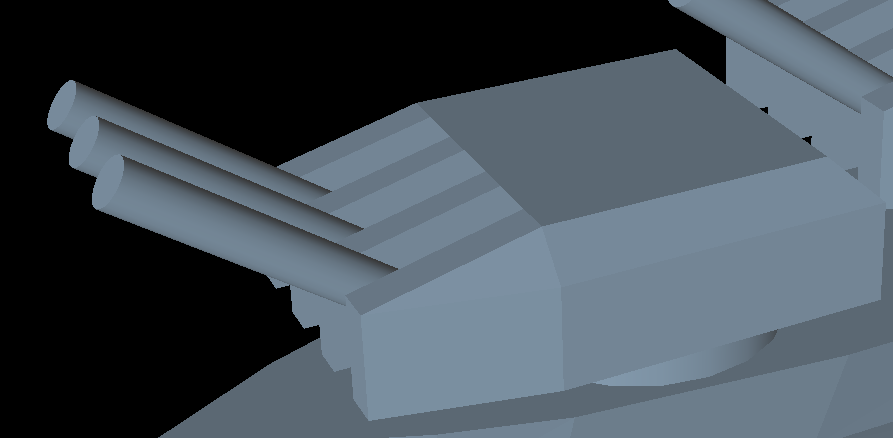
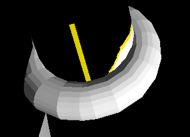

# COMP4411_Project2

## Required

- [x] Build a character
- [x] Implement glLookAt() equivalent

## TO-DO List
|BW|Task|Done|
|-|-|-|
|W|dramatic light|✔
|W|adjustable LoD|✔
|W|your ideas|
|B|texture map|✔
|B|polygonal faces (triangles)|✔
|B|animation|✔
|B|individual looking (not just red/green)|✔
|B|frame all|✔
|BW|up vector|✔
|2B|new primitives for each|✔
|2B|L-system|✔
|2B|mood cycling|✔
|4B|metaballs|✔
|8B|goal-oriented motion|✔
|+4B|joint contraints|✔

## Documentation
### Dramatic Light:
User can control the light **XYZ position** and the **diffuse color** using sliders.

### Adjustable Lod:
User can control the **level of detail** of the model using slider.

### Texture map:
The **human body** part of the model have implemented *texture*. 

### Polygonal Faces (triangles):
The **ship** and the **turret** part is drawn using *triangles*. 
 

### Animation:
User can enable **animation** in the menu bar.

### Individual Looking:
User can change some part of the model, such as **turret** and **lifebuoy**. 
 

### Frame All:
User can click **Frame All** in menu bar to position the camera to see the whole body of the model.

### Up Vector:
User can drag when holding `Alt + Right Click` to change the **up vector** of the camera.

### New Primitives:
Some object is created by function drawing new types of primitive, such as **chimney(curve over curver)** and **lifebuoy(torus)**. 
 

### L-system:
User can turn on the *L-system* in the model using slider, which will mimic **smoke**. 

### Mood Cycling:
For mood cycling, the model has two moods, namely happy and angry. When the value of mood is set to 1, it is the happy mode that the model would raise her hands and jump up. When the value of mood is set to 2, it is the angry mode that the model's arms would be akimbo and she seems angry. 
 

### Metaballs:
The hands of the model is being created by three **metaballs** each. One positive metaball and 2 negative metaballs to create the complex shape of the palm. 

### Goal-Oriented Motion + Joint Contraints:
User can control the legs of the model using **inverse kinematics**. Turn on `Apply IK` then use the leg and thigh target sliders to pose the legs. 
